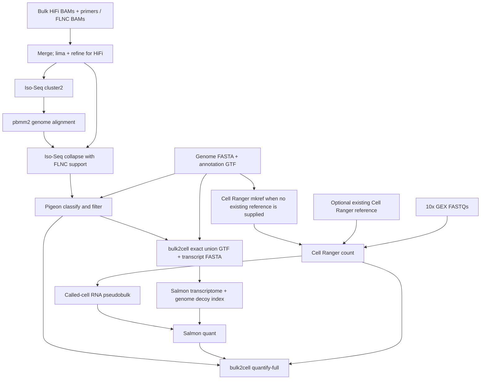

# bulk2cell — Nextflow workflow

<div align="center">
  
</div>

Bulk PacBio Iso-Seq assisted **10x 3′ gene-expression isoform quantification**, with the existing bulk2cell Python engine included under `software/bulk2cell`. This project runs Iso-Seq, Cell Ranger and Salmon as internal Nextflow processes. Conda supplies the open-source tools.

## Required inputs

To run the workflow, provide:

| Input | Requirement |
|---|---|
| Bulk PacBio BAM(s) | Unaligned **HiFi/CCS** (`hifi`) or refined **FLNC** (`flnc`), with PacBio metadata retained. Several BAMs from the same biological sample can be separated by `;`. |
| Primer FASTA | Required for `hifi`: exactly one 5′/3′ primer pair with headers ending `5p` and `3p`. Use the sequences from the actual library preparation. Omit for `flnc`. |
| 10x FASTQ directory and sample prefix | Demultiplexed paired R1/R2 `.fastq.gz`, standard `sample_S1_L001_R1_001.fastq.gz` naming (lane component optional); multiple lanes/chunks are supported. R1 is barcode/UMI, R2 is RNA. |
| 10x chemistry | `SC3Pv2`, `SC3Pv3`, or `SC3Pv4`. Explicit chemistry avoids guessing the assay. |
| Sample mapping | One CSV row per matched bulk/10x pair. Each row represents one biological sample and one 10x library. |
| Reference genome | Uncompressed FASTA with unique contig names. The workflow creates its index. |
| Corresponding annotation | Uncompressed exon GTF, including `gene_id` and `transcript_id`, using exactly the same genome build and contig names. Convert GFF3 to GTF before running. |
| Cell Ranger installation | An installed **Cell Ranger 9+** executable, accessible on every execution node. Set `cellranger` to its absolute path. |

Raw subreads require CCS/HiFi generation first. Aligned PacBio BAMs, full-length reads that still need refinement, multiplexed bulk samples, 10x 5′/Flex/ATAC/VDJ and multi-library aggregation are outside this initial interface. Split/demultiplex biological samples upstream. Existing Cell Ranger references and `quant.sf` are **not required**; the workflow generates `quant.sf` and builds a Cell Ranger reference unless one is supplied.

## Workflow



Each pair has its own Iso-Seq catalog and union reference; samples are joined by ID. Bulk2cell's own annotation adapter performs exact-structure deduplication, so Salmon and final quantification share transcript IDs. Cell Ranger uses `cellranger_reference` when supplied; otherwise it builds its reference from the original input genome FASTA and annotation GTF. It processes the Illumina FASTQs independently of Iso-Seq. Its gene assignments and names follow the annotation in its reference. Salmon and bulk2cell still use the Iso-Seq union. Novel genes absent from the input annotation will not receive Cell Ranger GX assignments and are excluded from downstream molecule quantification.

## First-time environment setup

Use Linux with Conda installed (for example, [Miniforge](https://github.com/conda-forge/miniforge)). Download or clone this repository, open a shell where `conda` is available, and enter the repository directory. Run all commands below from that directory.

Create and activate the runner environment once:

```bash
cd /path/to/bulk2cell
conda env create -p "$PWD/.conda/runner" -f envs/runner.yml
conda activate "$PWD/.conda/runner"
nextflow -version
```

The runner includes Nextflow and Java; no separate installation is needed. If `conda activate` is unavailable in Bash, run `conda init bash`, reopen your terminal, and activate the environment again. In later sessions, enter the repository directory and run only the activation command.

Install **Cell Ranger 9+** separately from [10x Genomics](https://www.10xgenomics.com/support/software/cell-ranger/downloads). It is **not installed through Conda**. Record the absolute path to its `cellranger` executable for the parameters file, and check the installation:

```bash
/path/to/cellranger/cellranger --version
```

With `-profile conda`, Nextflow creates task environments from `envs/python.yml`, `envs/isoseq.yml`, and `envs/salmon.yml` on first use and caches them under `.conda/tasks`. Allow extra time for the first run and network access to conda-forge/bioconda during installation. The Python engine is staged with tasks and imported via `PYTHONPATH`; a separate pip install is unnecessary.

### Optional: create task environments in advance

To install all task environments before running the workflow:

```bash
for tool in python isoseq salmon; do
    conda env create -p "$PWD/.conda/$tool" -f "envs/$tool.yml"
done
```

After creating all three, replace `-profile conda` with `-profile conda,installed` in the run commands below. Exact Linux package locks are also available under `envs/locks/`; recreate a prefix with `conda create -p PREFIX --file envs/locks/TOOL-linux-64.txt`, replacing `PREFIX` and `TOOL` as appropriate.

## Configure and run for the first time

Copy the example configuration files:

```bash
mkdir -p config
cp examples/samples.csv config/samples.csv
cp examples/params.yaml config/params.yaml
```

Edit both copies before running; the examples contain placeholder paths, not runnable demonstration data.

1. In `config/samples.csv`, add one row per matched bulk/10x pair using the columns in the example. Set `pacbio_stage` to `hifi` or `flnc`; supply the primer FASTA for `hifi` and leave `primers` empty for `flnc`. Set the FASTQ sample prefix and chemistry for each library. Keep sample IDs to letters, digits, underscores and hyphens. Paths inside the CSV are relative to **the CSV's directory**, or absolute.
   For multiple sequencing runs of the same 10x library, use one row with semicolon-separated exact prefixes in `fastq_sample`, for example `HBA8_3-1;HBA8_3-2;HBA8_3-3`. Set `fastq_dir` to the directory containing all pairs. The workflow checks paired FASTQs for every prefix and passes them together to Cell Ranger. Independently prepared 10x libraries need separate rows, even when they come from the same biological sample.

2. In `config/params.yaml`, set `input` to the absolute path of your copied CSV, `genome` to your FASTA, `annotation` to your GTF, `outdir` to the desired results directory, and `cellranger` to the installed executable. Use absolute paths for these entries. The remaining settings can keep their example defaults for the first run.
3. Choose a work directory with enough space for intermediate references, BAMs and indexes. Replace `/path/to/bulk2cell-work` below with that directory.

With the runner environment active, start the workflow:

```bash
nextflow run main.nf -profile conda \
    -params-file "$PWD/config/params.yaml" \
    -work-dir /path/to/bulk2cell-work
```

To reuse a Cell Ranger transcriptome reference, set `cellranger_reference: /path/to/refdata-gex-reference` in your parameters file, or add `--cellranger_reference /path/to/refdata-gex-reference` to the command. Supply the reference root containing `reference.json`, `fasta/genome.fa`, `genes/genes.gtf` (or `genes.gtf.gz`), and `star/`. The workflow checks this structure and shares the reference across all samples, skipping every `cellranger mkref` task. Omit the option or leave it `null` to build references as before. The Cell Ranger executable is still required for `count`.

`genome` and `annotation` remain required for Iso-Seq, Salmon and bulk2cell. Use the same genome assembly, contig names and compatible gene IDs as the supplied Cell Ranger reference; the structure check does not establish biological compatibility or validate the index contents. Existing references are staged for use and are not copied into the results' `cellranger_reference/` directories.

The default executor runs locally. Defaults reach 192 GB for clustering/alignment and 64 GB for Cell Ranger/quantification; review the resource requirements before starting. `conf/resources.config` provides example resource overrides; adapt a copy to your available resources and load it with `-c /path/to/resources.config`. Work storage can substantially exceed input size because references, BAMs and indexes are created per sample.

Resume the same run after interruption using the same configuration and work directory:

```bash
nextflow run main.nf -profile conda \
    -params-file "$PWD/config/params.yaml" \
    -work-dir /path/to/bulk2cell-work -resume
```

Keep the Nextflow launch directory, `.nextflow` cache and work directory for resume. Use a fresh results directory for a different sample set/configuration to avoid mixing published results. The input validator reruns on resume; completed scientific tasks use Nextflow's cache. Input FASTQ directories must remain immutable while running/resuming.

For Slurm, use `-profile conda,slurm` (or `-profile conda,installed,slurm` with pre-created environments) and provide your queue/account through a config loaded with `-c`. All input paths, work storage, the Cell Ranger installation and Conda environments must be visible to compute nodes.

## Outputs

```text
results/
├── pipeline_info/                 # validated samples, trace, DAG, timing and report
└── SAMPLE/
    ├── isoseq/flnc/                # refined BAM and PacBio index
    ├── isoseq/collapse/            # collapsed structures, FLNC counts, read assignments
    ├── isoseq/pigeon/              # filtered structures and classifications
    ├── reference/                 # exact union GTF/FASTA and alias/QC JSON
    ├── cellranger_reference/       # sample-specific reference, only when mkref runs
    ├── cellranger/                 # tagged/indexed BAM, barcodes, gene matrix and web summary
    ├── salmon/                    # quant.sf, mapping metadata, read-selection QC
    └── bulk2cell/quantification/   # all-gene results and completion manifest
```

The final `run.json` is the engine completion record. Read `software/bulk2cell/docs/FULL_QUANTIFICATION.md` for the full-engine layout and ablation outputs. Count matrices are **cells × features**, with fractional expected UMI counts. Intermediate task commands/logs remain in the work directory.

## Scientific settings and limits

- `tau: 10` uses Salmon abundance together with Iso-Seq support. Set `tau: 0` for an Iso-Seq-only prior; Salmon still runs and its output remains available.
- Pigeon performs classify/filter with its bundled defaults. This project does not supply optional CAGE/poly(A) evidence; additional evidence-based filtering should be assessed for the study.
- Individual-read empirical TES is not inferred in this version. The engine records its **annotation-TES fallback**. FLNC/read-assignment outputs are retained for a future empirical TES branch.
- Salmon uses the RNA mate from primary mapped reads carrying called-cell `CB` and corrected `UB`. It retains PCR copies and does not perform UMI deduplication. This is a pseudobulk abundance prior; final cell counts use bulk2cell's UMI model.
- The index includes genomic decoys and preserves duplicate transcript sequences. `salmon_libtype: A` detects strand orientation; inspect Salmon's mapping metadata. Single-end fragment mean/SD default to 200/80 nt and are configurable. `--noLengthCorrection` avoids ordinary full-length abundance correction for 3′-tag reads; 3′ data still cannot resolve all isoforms.
- Cell Ranger runs with `--include-introns=false`, consistent with the mature transcript model. Single-nucleus intronic evidence is not quantified by this workflow.
- Structural union construction and final quantification use the same reference/Pigeon import code. Eligibility/exclusions and alias mapping are recorded; this is a research workflow, without an end-to-end biological validation claim.

## Tests

For the checks below, first create the optional task environments described above. Run these commands from the repository directory.

```bash
conda activate "$PWD/.conda/python"
PYTHONPATH="$PWD/software/bulk2cell/src" OPENBLAS_NUM_THREADS=1 OMP_NUM_THREADS=1 \
    SALMON="$PWD/.conda/salmon/bin/salmon" PATH="$PWD/.conda/salmon/bin:$PATH" \
    python -m pytest tests/workflow software/bulk2cell/tests -q
conda activate "$PWD/.conda/runner"
bash tests/workflow/smoke.sh
```

The smoke test creates two artificial sample manifests and uses `-stub-run`; it checks both HiFi and FLNC routes, sample joins and final output locations. It checks 24 task completions with reference building, 22 with an existing reference, staging of the shared reference for both samples, and rejection of invalid reference paths. Its empty BAM/FASTQ fixtures are **not biological test data**. Stub outputs explicitly say `status: stub` and must never be used as results. See `docs/VALIDATION.md` for this delivery's checks.
