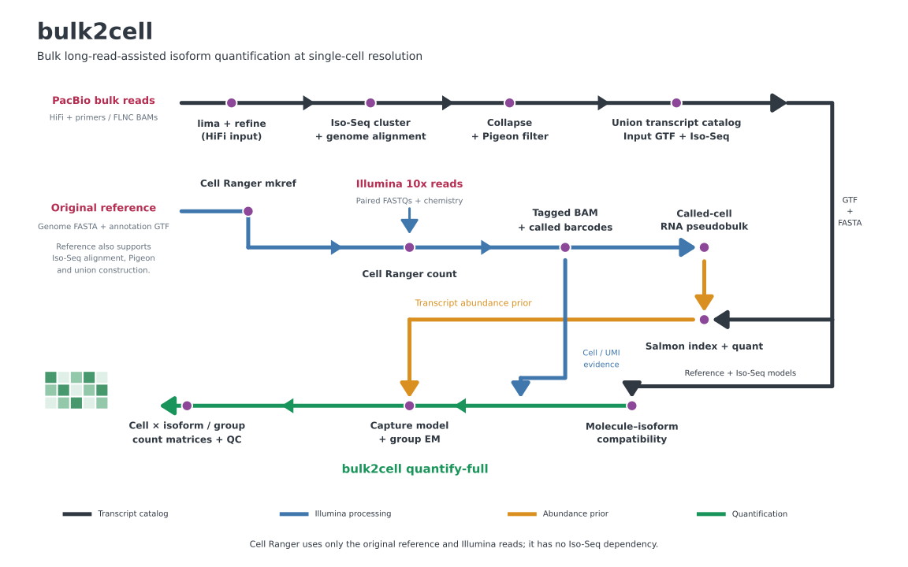
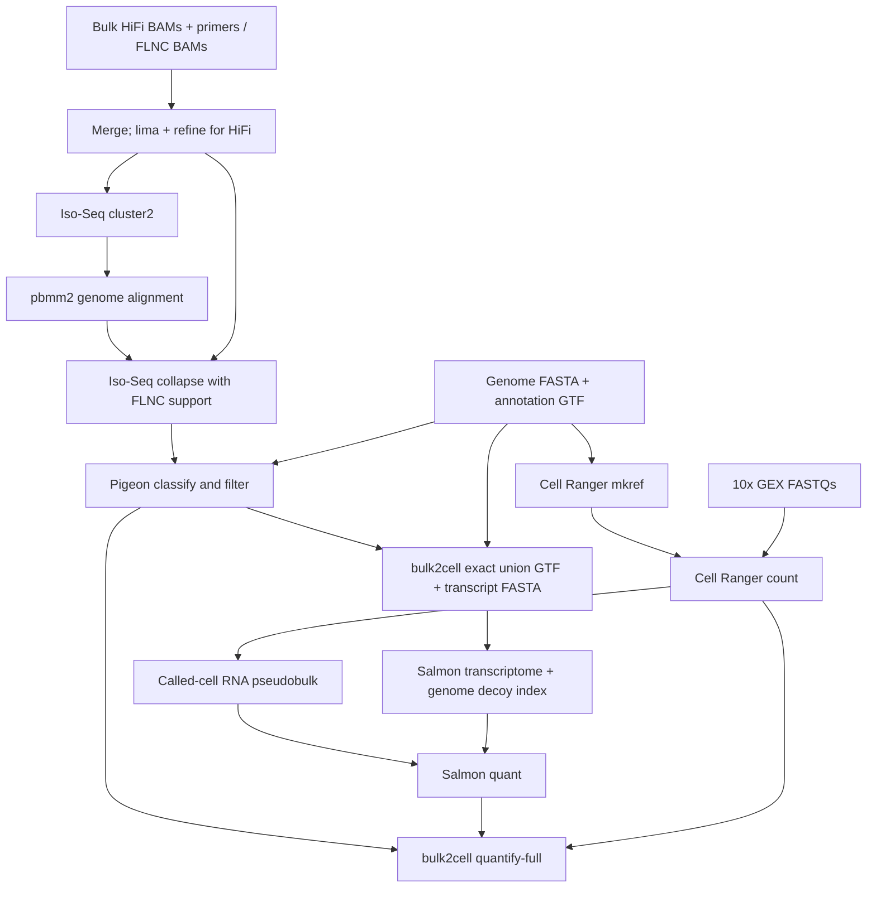

# bulk2cell — Nextflow workflow

<div align="center">
  
</div>

Bulk PacBio Iso-Seq assisted **10x 3′ gene-expression isoform quantification**, with the existing bulk2cell Python engine included under `software/bulk2cell`. This project runs Iso-Seq, Cell Ranger and Salmon as internal Nextflow processes. Conda supplies the open-source tools.

## Required inputs

Your input categories are sufficient to structure the workflow. To run it, provide:

| Input | Requirement |
|---|---|
| Bulk PacBio BAM(s) | Unaligned **HiFi/CCS** (`hifi`) or refined **FLNC** (`flnc`), with PacBio metadata retained. Several BAMs from the same biological sample can be separated by `;`. |
| Primer FASTA | Required for `hifi`: exactly one 5′/3′ primer pair with headers ending `5p` and `3p`. Use the sequences from the actual library preparation. Omit for `flnc`. |
| 10x FASTQ directory and sample prefix | Demultiplexed paired R1/R2 `.fastq.gz`, standard `sample_S1_L001_R1_001.fastq.gz` naming (lane component optional); multiple lanes/chunks are supported. R1 is barcode/UMI, R2 is RNA. |
| 10x chemistry | `SC3Pv2`, `SC3Pv3`, or `SC3Pv4`. Explicit chemistry avoids guessing the assay. |
| Sample mapping | One CSV row per matched bulk/10x pair. Each row represents one biological sample and one 10x library. |
| Reference genome | Uncompressed FASTA with unique contig names. The workflow creates its index. |
| Corresponding annotation | Uncompressed exon GTF, including `gene_id` and `transcript_id`, using exactly the same genome build and contig names. Convert GFF3 to GTF before running. |
| Cell Ranger installation | An installed **Cell Ranger 9+** executable, accessible on every execution node. Set `cellranger` to its absolute path. |

Raw subreads require CCS/HiFi generation first. Aligned PacBio BAMs, full-length reads that still need refinement, multiplexed bulk samples, 10x 5′/Flex/ATAC/VDJ and multi-library aggregation are outside this initial interface. Split/demultiplex biological samples upstream. Existing Cell Ranger references and `quant.sf` are **not required**; the workflow builds them.

## Workflow



Each pair has its own Iso-Seq catalog and union reference; samples are joined by ID. Bulk2cell's own annotation adapter performs exact-structure deduplication, so Salmon and final quantification share transcript IDs. Cell Ranger builds its reference from the original input genome FASTA and annotation GTF and processes the Illumina FASTQs independently of Iso-Seq. Its gene assignments and names follow the input annotation. Salmon and bulk2cell still use the Iso-Seq union. Novel genes absent from the input annotation will not receive Cell Ranger GX assignments and are excluded from downstream molecule quantification.

## Conda setup

```bash
cd /homeb/user/repos/bulk2cell
conda env create -p "$PWD/.conda/runner" -f envs/runner.yml
conda activate "$PWD/.conda/runner"
```

All four environments have already been created on this host; activate the runner directly and use `-profile conda,installed`. The existing Cell Ranger executable is `/homeb/user/cellranger-10.1.0/cellranger`. On a new machine, run the create command once. Nextflow's `conda` profile creates and caches task environments from `envs/python.yml`, `envs/isoseq.yml`, and `envs/salmon.yml` on first use. Network access to conda-forge/bioconda is required during installation.

Cell Ranger is distributed separately by 10x Genomics and is **not installed through Conda**. Install its official distribution and set the executable path in your parameters file. It remains an internal workflow stage.

To pre-create all task environments manually:

```bash
for tool in python isoseq salmon; do
    conda env create -p "$PWD/.conda/$tool" -f "envs/$tool.yml"
done
```

Use `-profile conda,installed` to use these pre-created environments. Exact Linux package locks are saved under `envs/locks/`; recreate a prefix with `conda create -p PREFIX --file envs/locks/TOOL-linux-64.txt`. Use just `-profile conda` for Nextflow-managed environment creation. The Python engine is staged with tasks and imported via `PYTHONPATH`; a separate pip install is unnecessary.

## Configure and run

Copy `examples/samples.csv` and `examples/params.yaml` and replace the example paths. Paths inside the CSV are relative to **the CSV's directory**, or absolute. Parameters-file paths should be absolute. Keep sample IDs to letters, digits, underscores and hyphens.

```bash
nextflow run main.nf -profile conda \
    -params-file /path/to/params.yaml \
    -work-dir /scratch/bulk2cell-work
```

Resume the same run after interruption:

```bash
nextflow run main.nf -profile conda \
    -params-file /path/to/params.yaml \
    -work-dir /scratch/bulk2cell-work -resume
```

Keep the Nextflow launch directory, `.nextflow` cache and work directory for resume. Use a fresh results directory for a different sample set/configuration to avoid mixing published results. The input validator reruns on resume; completed scientific tasks use Nextflow's cache. Input FASTQ directories must remain immutable while running/resuming.

For Slurm, use `-profile conda,slurm` and provide your queue/account through a local config. All paths and Conda environments must be visible to compute nodes. `conf/resources.config` shows process-level resource overrides. Defaults reach 192 GB for clustering/alignment and 64 GB for Cell Ranger/quantification; tune against your dataset and cluster. Work storage can substantially exceed input size because references, BAMs and indexes are created per sample.

For this host, after filling in the input paths, use:

```bash
nextflow run main.nf -profile conda,installed -c conf/this-host.config \
    -params-file /path/to/params.yaml -resume
```

Set `cellranger` in the parameters file to `/homeb/user/cellranger-10.1.0/cellranger`, or remove that key so the host config applies.

## Outputs

```text
results/
├── pipeline_info/                 # validated samples, trace, DAG, timing and report
└── SAMPLE/
    ├── isoseq/flnc/                # refined BAM and PacBio index
    ├── isoseq/collapse/            # collapsed structures, FLNC counts, read assignments
    ├── isoseq/pigeon/              # filtered structures and classifications
    ├── reference/                 # exact union GTF/FASTA and alias/QC JSON
    ├── cellranger_reference/       # sample-specific genome reference
    ├── cellranger/                 # tagged/indexed BAM, barcodes, gene matrix and web summary
    ├── salmon/                    # quant.sf, mapping metadata, read-selection QC
    └── bulk2cell/quantification/   # all-gene results and completion manifest
```

The final `run.json` is the engine completion record. Read `software/bulk2cell/docs/FULL_QUANTIFICATION.md` for the full-engine layout and ablation outputs. Count matrices are **cells × features**, with fractional expected UMI counts. Intermediate task commands/logs remain in the work directory.

## Scientific settings and limits

- `tau: 10` uses Salmon abundance together with Iso-Seq support. Set `tau: 0` for an Iso-Seq-only prior; Salmon still runs and its output remains available.
- Pigeon performs classify/filter with its bundled defaults. This project does not supply optional CAGE/poly(A) evidence; additional evidence-based filtering should be assessed for the study.
- Individual-read empirical TES is not inferred in this version. The engine records its **annotation-TES fallback**. FLNC/read-assignment outputs are retained for a future empirical TES branch.
- Salmon uses the RNA mate from primary mapped reads carrying called-cell `CB` and corrected `UB`. It retains PCR copies and does not perform UMI deduplication. This is a pseudobulk abundance prior; final cell counts use bulk2cell's UMI model.
- The index includes genomic decoys and preserves duplicate transcript sequences. `salmon_libtype: A` detects strand orientation; inspect Salmon's mapping metadata. Single-end fragment mean/SD default to 200/80 nt and are configurable. `--noLengthCorrection` avoids ordinary full-length abundance correction for 3′-tag reads; 3′ data still cannot resolve all isoforms.
- Cell Ranger runs with `--include-introns=false`, consistent with the mature transcript model. Single-nucleus intronic evidence is not quantified by this workflow.
- Structural union construction and final quantification use the same reference/Pigeon import code. Eligibility/exclusions and alias mapping are recorded; this is a research workflow, without an end-to-end biological validation claim.

## Tests

```bash
conda activate "$PWD/.conda/python"
PYTHONPATH="$PWD/software/bulk2cell/src" OPENBLAS_NUM_THREADS=1 OMP_NUM_THREADS=1 \
    SALMON="$PWD/.conda/salmon/bin/salmon" PATH="$PWD/.conda/salmon/bin:$PATH" \
    python -m pytest tests/workflow software/bulk2cell/tests -q
conda activate "$PWD/.conda/runner"
bash tests/workflow/smoke.sh
```

The smoke test creates two artificial sample manifests and uses `-stub-run`; it checks both HiFi and FLNC routes, sample joins, 24 task completions and final output locations. Its empty BAM/FASTQ fixtures are **not biological test data**. Stub outputs explicitly say `status: stub` and must never be used as results. See `docs/VALIDATION.md` for this delivery's checks.
